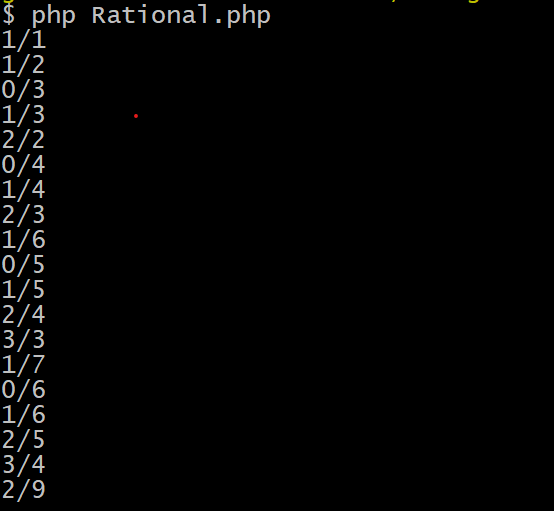

## Assignment #4 - Sequences and recursion
## Discrete Mathematics

by Rasmus Friis

# 1 Rational sequence
Create a class Rationals that implements the Sequence of Positive Rational
Numbers as discussed in class.
The class must implement a method String rational(long n) that returns
the rational number on the nth place in the sequence.
Also let the class implement Iterable (IEnumerable in C#)

## how to run
php Rational.php i terminal. 
 
the output is
 
 

